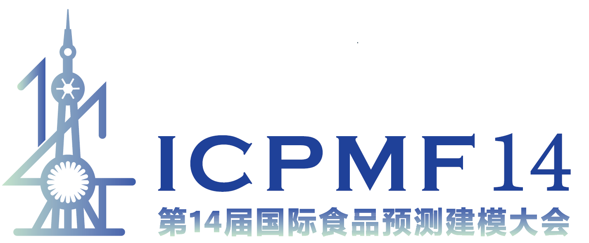

## Upcoming

### ICPMF14 will be held from June 23–25, 2027, in Shanghai, China

|                                                        |
|--------------------------------------------------------|
| [{fig-align="center" width="800px"}](http://microrisk.cn/) |

**International Committee on Predictive Modelling in Food (ICPMF)** is pleased to act as a co-host for **the International Conference on Predictive Modelling in Food (ICPMF14)** jointly with **the Conference on Food Microbiological Risk Assessment (MicroRisk 2027)**, to be held from June 23–25, 2027, in **Shanghai, China** ([http://microrisk.cn/](http://microrisk.cn/)). The conference theme is **Better Model, Better Life**.    
Professor Dr. Dong Qingli from the University of Shanghai for Science and Technology (USST) was officially awarded the hosting rights for ICPMF14. The committee also acknowledges that the Conference on Food Microbiological Risk Assessment (MicroRisk) is a well-established series initiated by Professor Dong in China since 2014. We are delighted that ICPMF14 will be jointly organized with MicroRisk 2027, fostering stronger collaboration between the international and Chinese academic communities.